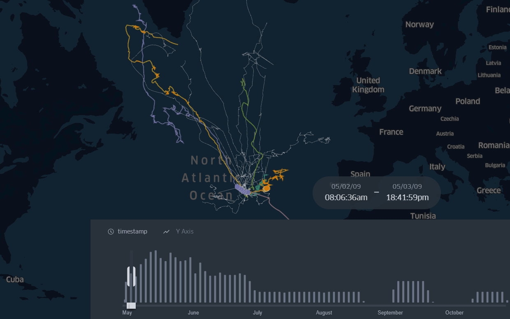

# Summary
This demo contains the Great Whale's migration routes with a time filter of 2009. 

***Final map animation:*** https://bryanvallejo16.github.io/whale-tracking-azores/

***Tutorial:*** https://towardsdatascience.com/time-filter-for-great-whales-migration-routes-32c429ac6bb9

# Map animation 

